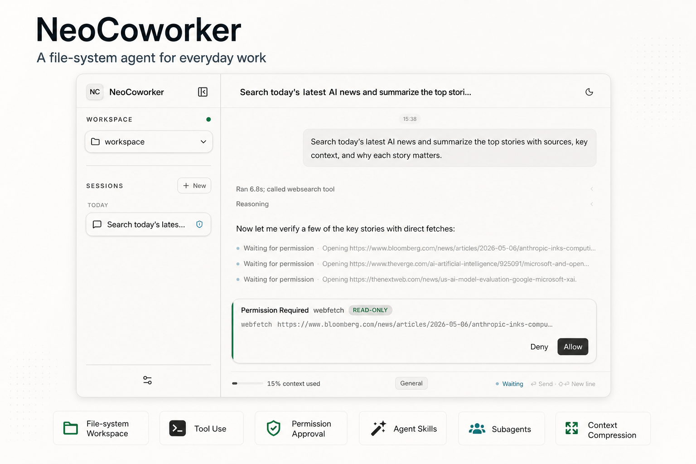

# Neo Coworker

[English](README.md) · **简体中文**

**Neo Coworker** 是我用来处理一些日常工作的 file-system based Agent，拥有 tool-use，兼容标准 agent skills，权限审批，subagent，包括自动/手动 compact 在内的上下文管理，以及以文件夹为隔离的 workspace 等特性。

<p align="center">
  <a href="docs/assets/neo-coworker.png">
    
  </a>
</p>

## 快速开始（桌面端）

- 在项目根目录执行以下命令，会自动安装依赖，并启动 Electron 桌面应用：
  ```bash
  bun run desktop:start
  ```

- 首次启动时，可以直接在桌面端设置界面里填写 LLM 参数。如果项目根目录存在 .env，它们会作为设置界面的初始默认值。

## 环境要求

- [Bun](https://bun.sh/)
- 暂时仅支持 Linux, MacOS, Windows 建议使用 WSL。

## 其它脚本

| 脚本 | 说明 |
| --- | --- |
| `bun run dev chat` | 启动 CLI 入口 |
| `bun run server` | 启动 HTTP/SSE 应用服务 |

## 文档

- 架构：`docs/ARCHITECTURE.md`
- 开发：`docs/dev/`
